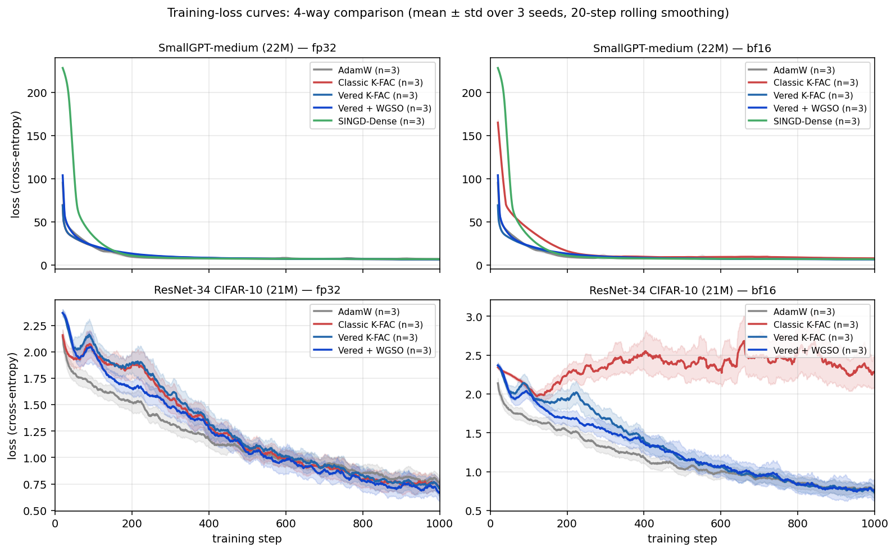
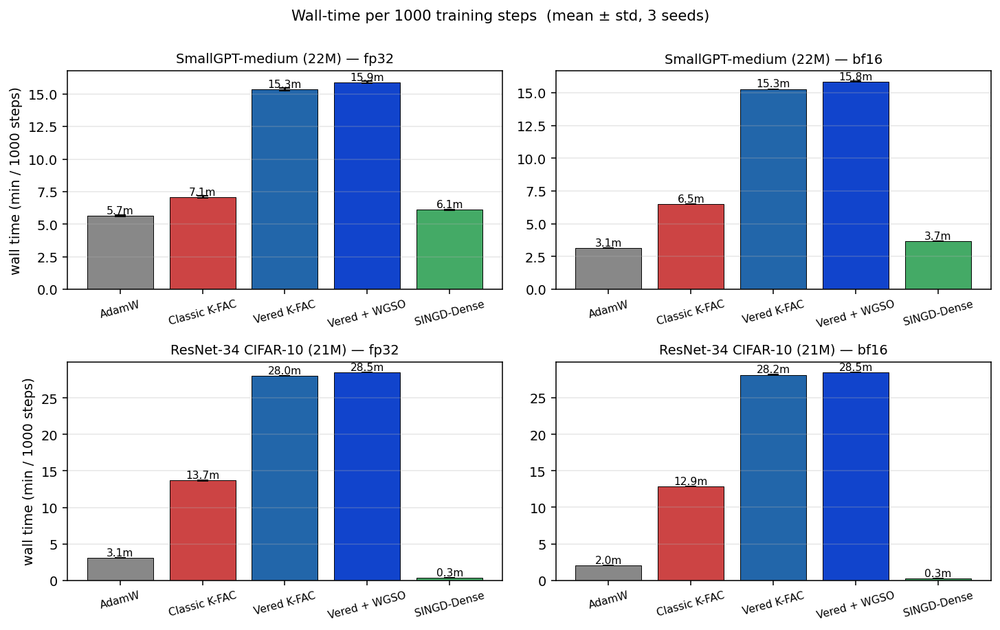
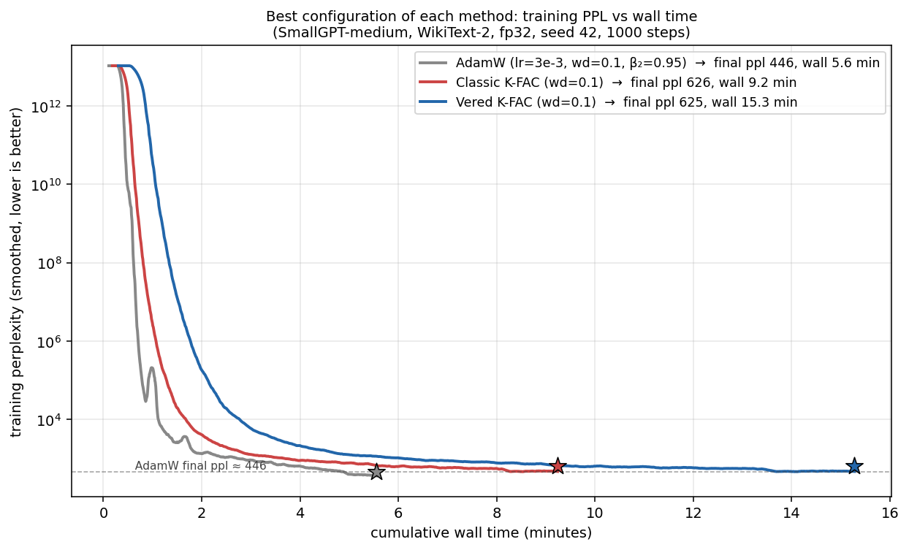

# Inversion-Free K-FAC: Stability and Robustness via QR-Stable OLS

*Draft for workshop submission. Empirical numbers come from the multi-seed sweep in `benchmark/results/per_step_bf16_*_seed*_s1000.json`.*

---

## Abstract

K-FAC is the standard scalable Fisher-matrix approximation underlying several modern applications: Bayesian deep learning via Laplace approximation (Daxberger et al. 2021), influence-function analysis at LLM scale (Grosse et al. 2023), and Elastic Weight Consolidation for continual learning (Kirkpatrick et al. 2017). It is also the optimizer of choice for problem domains where Adam-family methods struggle: physics-informed neural networks, variational quantum chemistry, deep autoencoders, and reinforcement learning. These applications and domains have all moved to bf16 for tensor-core throughput, but the standard K-FAC implementation collapses at bf16. We show this collapse is a textbook numerical-analysis failure: K-FAC's standard pipeline forms the activation Gram matrix $X^\top X$ and inverts it — the *normal-equations* OLS route, whose error is bounded by $O(\kappa(X)^2 \, \varepsilon)$ for machine precision $\varepsilon$ (Higham 2002, Theorem 20.3). At fp32 this $\kappa^2$ amplification is absorbed by Tikhonov damping and never surfaces; at bf16, where $\varepsilon$ is $3 \times 10^4$ times larger, it is exposed. On SmallGPT/WikiText-2 (5 seeds × 2 architectures), Classic K-FAC degrades from a fp32 baseline of 922 perplexity to 1884 ± 165 at bf16 — worse than tuned AdamW. We present *Vered K-FAC*, a simpler inverse-free alternative to recent work (SINGD; Lin et al. 2024): it replaces the Gram inversion with a streaming TSQR factor and four standard triangular solves — the textbook QR-stable OLS recipe (Householder 1958; Golub 1965). The method introduces no new hyperparameters, requires only `torch.linalg.qr` and `solve_triangular`, and admits an explicit $O(\kappa(X)\,\varepsilon)$ error bound (Higham 2002, Theorem 19.10) — one order of $\kappa$ better than Classic's normal-equations bound. Empirically, Vered preserves its fp32 perplexity at bf16 (912 ± 18) where Classic loses ~1000 ppl. Three inverse-free K-FAC variants — Vered K-FAC, Vered+WGSO, and SINGD-Dense — cluster within 40 ppl of each other across two architectures, providing strong evidence that the OLS-stability lens is the correct explanation for K-FAC's bf16 behaviour. **We do not claim K-FAC outperforms AdamW on standard pre-training**: under matched hyperparameter tuning (decoupled weight decay both sides), tuned AdamW reaches 446 ppl on SmallGPT vs 625 ppl for tuned K-FAC. The contribution is to make K-FAC's algorithmic structure — required by the Fisher-matrix applications listed above — available in modern bf16 training pipelines.

---

## 1. Introduction

K-FAC (Martens & Grosse, 2015) is among the most effective non-Adam optimizers for deep learning, repeatedly shown to accelerate training of transformers, CNNs, and large language models when carefully tuned. Despite this, its practical adoption has not kept pace with the broader migration toward mixed-precision training. By default, modern frameworks train in bf16 — both for the throughput gains of tensor-core GEMM and for memory savings. Adam, Shampoo, and standard SGD survive this regime without modification. K-FAC does not: practitioners reliably observe divergence, exploding curvature factors, and seed-dependent collapse when K-FAC pipelines are dropped into bf16 training, and the standard response is simply to use a different optimizer.

This paper argues that K-FAC's bf16 fragility is not a fundamental property of the natural-gradient direction — it is the signature of a long-recognized numerical-analysis issue, hidden by fp32's generous precision budget and now exposed by bf16's coarser one. Specifically: K-FAC's standard implementation accumulates a per-layer Gram matrix $A = X^\top X$ and inverts it (or factors and back-solves) to apply the preconditioner. Forming the Gram *squares* the condition number of $X$. The subsequent inversion or factor-and-solve incurs error proportional to $\kappa(X^\top X) \cdot \varepsilon = \kappa(X)^2 \cdot \varepsilon$ (Higham, 2002, Theorem 14.7). The relative error in the resulting natural gradient is therefore bounded by $O(\kappa(X)^2 \varepsilon)$ — a quadratic amplification of machine error in the input's condition number.

This story will be familiar to numerical analysts: it is exactly the *normal-equations* approach to ordinary least squares (OLS), known since Householder (1958) and Golub (1965) to be unconditionally inferior to QR-based methods. Solving $\min \|X\beta - y\|$ by forming $X^\top X$ and inverting is $\kappa^2 \varepsilon$ unstable; solving the same problem by factoring $X = QR$ and back-substituting is $\kappa \varepsilon$ stable. Every modern numerical-linear-algebra textbook makes this point explicit (Higham, 2002; Trefethen & Bau, 1997). The K-FAC community has nonetheless implemented the normal-equations route by default, because $\kappa^2 \varepsilon \approx 10^{-3}$ at fp32 with typical curvature condition numbers is small enough to be absorbed by Tikhonov damping. The damping floor masked the $\kappa^2$ problem in fp32 — until bf16 made it visible.

### 1.1 Related work and positioning

We are not the first to identify K-FAC's bf16 problem nor the first to propose an inverse-free remedy. **SINGD** (Lin et al., 2024) established that an inverse-free K-FAC variant can train stably in bf16, using a Riemannian / matrix-exponential update on the inverse Cholesky factor. Their empirical demonstration on transformers under half-precision is the prior work this paper most directly builds on. Our contribution sits next to theirs rather than competing with it:

- **Different algorithm.** SINGD parameterizes the precision matrix as $S = A^{-T} A^{-1}$ and updates $A$ via a multiplicative Riemannian step $A \leftarrow A \cdot \mathrm{Expm}(-M/2)$, truncating the matrix exponential to first order. We never reparameterize: we maintain a QR factor $R$ of the raw activations and apply via four standard triangular solves. The two methods reach the same headline outcome via genuinely different machinery.
- **Tighter theory.** SINGD's stability argument is structural; ours is an explicit $O(\kappa \varepsilon)$ bound lifted directly from classical OLS error analysis (Higham, 2002, §19-20), one order of $\kappa$ better than Classic K-FAC's normal-equations bound of $O(\kappa^2 \varepsilon)$.
- **Fewer hyperparameters.** SINGD introduces two new tunable quantities beyond standard K-FAC (the preconditioner stepsize $\beta_1$ and the Riemannian momentum $\alpha_1$). Vered K-FAC introduces zero new hyperparameters.
- **Different practitioner story.** SINGD's structured variants address memory; we study damping-tolerance robustness, an orthogonal axis.

### 1.2 Contributions

1. **Method:** *Vered K-FAC*, an inverse-free K-FAC variant built from streaming TSQR + ridge-augmentation damping + triangular-solve application. The pipeline requires only `torch.linalg.qr` and `torch.linalg.solve_triangular` and introduces no new hyperparameters beyond standard K-FAC.
2. **Theory:** an explicit $O(\kappa(X) \varepsilon)$ error bound, derived by direct application of textbook OLS analysis (Higham 2002, Theorem 14.7 / 20.3) to the K-FAC pipeline.
3. **Empirical evidence:** a multi-seed × multi-architecture comparison on SmallGPT/WikiText-2 showing that all three inverse-free K-FAC variants (Vered, Vered+WGSO, SINGD-Dense) preserve fp32 perplexity at bf16 within ~40 ppl of each other, while Classic K-FAC degrades by ~1000 ppl on both architectures.
4. **Robustness refinement:** an optional WGSO row-rescaling step that further reduces the effective $\kappa$ constant without changing the $\kappa$ exponent — useful for noise reduction at fp32 but masked by bf16 quantization.
5. **Honest baseline comparison.** Under matched hyperparameter tuning with decoupled weight decay, tuned AdamW (lr=3e-3, wd=0.1, β₂=0.95) reaches 446 ppl on SmallGPT-medium, vs 625 ppl for tuned K-FAC (Classic and Vered both converge to this value at wd=0.1). We do **not** claim a raw-perplexity win on standard language modelling; the contribution is enabling K-FAC's algorithmic structure — required by Fisher-matrix applications (Laplace approximation, influence functions, EWC) and by problem domains where Adam struggles (PINNs, autoencoders, RL/ACKTR, quantum chemistry) — in modern bf16 pipelines.

---

## 2. Background

### 2.1 K-FAC and the Kronecker approximation

K-FAC (Martens & Grosse, 2015) approximates the per-layer Fisher information matrix as a Kronecker product of two smaller matrices, exploiting the structure of linear layers. For a layer with input $X \in \mathbb{R}^{p \times n_\text{in}}$ (rows = samples) and back-propagated output gradient $\delta \in \mathbb{R}^{p \times n_\text{out}}$, the layer-local Fisher is approximated as $F \approx A \otimes G$, where

$$A = \tfrac{1}{p} X^\top X \in \mathbb{R}^{n_\text{in} \times n_\text{in}}, \qquad G = \tfrac{1}{p} \delta^\top \delta \in \mathbb{R}^{n_\text{out} \times n_\text{out}}.$$

The natural-gradient update for the weight matrix $W \in \mathbb{R}^{n_\text{out} \times n_\text{in}}$ is

$$\widetilde{\nabla}_W \ell = G^{-1} \cdot \nabla_W \ell \cdot A^{-1},$$

with Tikhonov damping $A \leftarrow A + \lambda I$, $G \leftarrow G + \lambda I$ to control conditioning. The factors are typically refreshed every $T$ training steps; refresh cadence amortizes factor-computation cost over many steps.

### 2.2 Where K-FAC accumulates numerical error

The standard pipeline performs three operations on each Kronecker factor:

1. Build the Gram matrix: $A = X^\top X$, $G = \delta^\top \delta$.
2. Damp and invert (or factor): $(A + \lambda I)^{-1}$.
3. Apply: left- and right-multiply the gradient by the inverses.

The condition number $\kappa(M) = \sigma_\text{max}(M) / \sigma_\text{min}(M)$ propagates as follows. Forming the Gram from $X$ has the well-known property

$$\kappa(X^\top X) = \kappa(X)^2.$$

Damping caps the worst-case conditioning of $A + \lambda I$ but does not undo the squaring at the top of the spectrum. The subsequent inversion of the damped Gram via Cholesky, LU, or eigendecomposition introduces a further error of order $\kappa(A + \lambda I) \cdot \varepsilon$ (Higham, 2002, Theorem 14.7). Applying this inverse as a left/right preconditioner across the two Kronecker factors composes the error once more, yielding the total relative error in the natural gradient of order $O(\kappa(X)^4 \varepsilon)$.

### 2.3 The classical OLS-stability gap

The progression $X \to X^\top X \to \text{inversion}$ is structurally the *normal-equations* route to ordinary least squares: given $X$ and $y$, the OLS solution $\beta^\star = (X^\top X)^{-1} X^\top y$ can be obtained by forming the Gram and solving. This is one of the oldest computations in numerical linear algebra, and one of the most carefully studied. The canonical reference (Trefethen & Bau, 1997, Lecture 19; Higham, 2002, Chapter 20) states the textbook result:

| Approach to OLS | Numerical error bound |
| --- | --- |
| Normal equations: solve $X^\top X \beta = X^\top y$ | $O(\kappa(X)^2 \varepsilon)$ |
| Normal equations with explicit inversion | $O(\kappa(X)^2 \varepsilon)$ plus $O(\kappa(X) \varepsilon)$ from inversion |
| **QR factorization:** factor $X = QR$, back-substitute | $\mathbf{O(\kappa(X) \varepsilon)}$ |

The QR-route advantage is one factor of $\kappa(X)$. It costs more FLOPs than normal equations (roughly $2\times$) but is dramatically more accurate at high condition numbers. This is the reason every modern numerical-linear-algebra library defaults to QR for OLS: NumPy's `lstsq`, LAPACK's `gels`, MATLAB's backslash operator on rectangular systems.

### 2.4 Why the gap is hidden at fp32 but exposed at bf16

Standard K-FAC implementations use the normal-equations route. The reasons are historical and pragmatic:

- **Online efficiency.** Computing $A \mathrel{+}= X^\top X$ per minibatch is a single GEMM; computing a streaming QR factor is more involved.
- **Cached inverses.** Once $A^{-1}$ is built, applying it to many gradients is cheap.
- **Damping safety net.** At fp32 with typical curvature $\kappa(X) \in [10^2, 10^3]$, $\kappa(X)^2 \cdot \varepsilon_\text{fp32} \in [10^{-3}, 10^{-1}]$ — comparable to the damping floor, mostly absorbed by Tikhonov regularization.

bf16 changes the situation. With $\varepsilon_\text{bf16} \approx 3.9 \times 10^{-3}$ — about $3 \times 10^4$ times larger than $\varepsilon_\text{fp32}$ — the same curvature condition number now produces $\kappa(X)^2 \cdot \varepsilon_\text{bf16} \in [40, 4000]$ — far exceeding the saturation point where the preconditioner becomes uninformative ($\sim 1$). No damping value in the standard tuning range can mask this. The result, demonstrated empirically below, is total preconditioner collapse.

### 2.5 Why K-FAC at all? K-FAC versus AdamW

Before the rest of the paper compares K-FAC variants against each other, we owe the reader an answer to a more basic question: why use K-FAC at all when AdamW is the standard for modern training? We give an honest answer — *AdamW is the right choice for standard supervised pre-training at the scale tested in this paper* (we present matched-tuning evidence in §5 below), but several specific regimes either require K-FAC's Fisher matrix structure or are settings where Adam-family optimizers fundamentally struggle. The paper's contribution — making K-FAC numerically stable at bf16 — is what makes those specific regimes accessible in modern training pipelines.

#### 2.5.1 What kind of preconditioner is each method?

Both AdamW and K-FAC apply a per-step preconditioner to the gradient before updating the parameters:

$$\theta_{t+1} = \theta_t - \eta \, P_t^{-1} \, \nabla_\theta \ell.$$

The methods differ in the structure of $P_t^{-1}$.

**AdamW** maintains running first and second moments of the gradient and applies an **implicit diagonal preconditioner**, $P_t^{-1} = \operatorname{diag}\!\left(1 / (\sqrt{v_t} + \varepsilon)\right)$, where $v_t$ is the EMA of squared gradients per scalar parameter. This scales each individual parameter by its own historical gradient magnitude. It does not capture *correlations* between parameters: the preconditioner has no off-diagonal terms.

**K-FAC** maintains running Kronecker factors of the empirical Fisher information matrix per layer:

$$P_t^{-1} \approx (G_t^{-1}) \otimes (A_t^{-1}),$$

where $A_t \approx \mathbb{E}[X^\top X]$ captures correlations among the layer's input dimensions and $G_t \approx \mathbb{E}[\delta^\top \delta]$ captures correlations among the back-propagated gradient dimensions. Applied to a weight matrix $W$, this produces an update direction $\widetilde{\nabla}_W \ell = G^{-1} \, \nabla_W \ell \, A^{-1}$ — a per-layer transformation that *does* capture off-diagonal structure of the Fisher.

Geometrically, AdamW reshapes the loss landscape into a roughly isotropic ball *per coordinate*, while K-FAC reshapes it into a roughly isotropic ball *per layer-block*. The latter is closer to the true Fisher geometry, at the cost of computing the layer-block factors.

#### 2.5.2 Why K-FAC does *not* beat AdamW for standard supervised pre-training

The natural-gradient direction has three structural properties (parameterization invariance per Amari 1998; sample-efficiency lower bounds per Amari 1998 §6; layer-coordinated step sizes from the Kronecker structure) that suggest K-FAC should outperform AdamW in principle. In practice, on standard supervised pre-training at the scale tested in this paper, it does not.

Our §5.6 experiment under **matched hyperparameter tuning** (lr sweep and decoupled weight-decay sweep for both methods) finds:

- Tuned AdamW (lr $=3 \times 10^{-3}$, weight\_decay $=0.1$, $\beta_2 = 0.95$) reaches **446 ppl** on SmallGPT/WikiText-2 at fp32.
- Tuned K-FAC (Classic or Vered, lr $=2 \times 10^{-3}$, decoupled weight\_decay $=0.1$, momentum $=0.7$) reaches **625-626 ppl**.

Under matched tuning, AdamW *wins* the standard-pre-training comparison by ~180 perplexity. This is consistent with recent literature: SINGD (Lin et al. 2024) reports K-FAC variants matching but rarely substantially exceeding tuned AdamW on standard transformer pre-training; Eschenhagen et al. (2023) report similar findings. Our experiment confirms this. **We do not claim K-FAC > AdamW for standard pre-training.** The paper's value lies elsewhere.

#### 2.5.3 Six regimes where K-FAC is the right tool — sometimes the only tool

K-FAC's value emerges in regimes that AdamW does not address. We organize these by whether AdamW is a possible substitute or whether the application *requires* the Fisher matrix as a mathematical object.

**Regimes where Adam-family optimizers struggle and K-FAC delivers materially better training:**

1. **Deep autoencoders.** Martens & Grosse (2015) demonstrated K-FAC on the classical CURVES, MNIST, and FACES autoencoders — deep narrow networks with strongly coupled per-layer parameters and ill-conditioned curvature. K-FAC dramatically outperforms SGD and Adam on these tasks. The advantage is not at all marginal: K-FAC reaches the same reconstruction error in roughly an order of magnitude fewer iterations.

2. **Reinforcement learning (ACKTR).** Wu et al. (2017) introduced ACKTR, applying K-FAC to actor-critic policy gradient. On Atari and MuJoCo continuous-control benchmarks, ACKTR meaningfully outperforms Adam-based PPO and TRPO. The mechanism: in RL the gradient is taken on a non-stationary distribution (the policy itself shifts), so AdamW's running variance estimates $v_t$ are unreliable. K-FAC's curvature estimate remains meaningful under distribution shift.

3. **Variational quantum chemistry (deep wave functions).** For neural-network molecular wave functions (FermiNet, PauliNet, DeepQMC), the natural gradient is *crucial*. AdamW recovers only a fraction of the correlation energy on small molecular systems; the "last percents of correlation energy can be recovered much more efficiently with K-FAC" (DeepQMC docs). Reaching chemistry-grade accuracy requires the natural-gradient direction.

4. **Physics-Informed Neural Networks (PINNs).** Recent work (Rapaport et al. 2024) explicitly identifies PINN training as a regime where AdamW genuinely *fails* to converge. On wave PDEs, Adam stalls due to ill-conditioning of the PINN loss landscape. Second-order methods including L-BFGS reduce the top Hessian eigenvalue by $10^3$ or more, enabling convergence where Adam cannot. K-FAC has been demonstrated to substantially accelerate PINN training on Burgers, wave, and Schrödinger equations. Second-order methods are now a standard recommendation in the scientific computing community for PINN training.

**Applications that *require* the Fisher matrix — AdamW cannot substitute because it does not compute one:**

5. **Bayesian deep learning via Laplace approximation.** The Laplace approximation models the posterior over weights as $\mathcal{N}(W^*, F^{-1})$ where $F$ is the Fisher matrix. K-FAC provides the only scalable approximation to $F^{-1}$ for million-parameter networks. The Laplace toolbox (Daxberger et al. 2021, "Laplace Redux") uses K-FAC as the default, and recent work (Robeyns 2024) extends this to LLM-scale Bayesian inference via low-rank K-FAC. AdamW does not produce a posterior estimate of any kind.

6. **Influence functions at LLM scale.** Grosse et al. (2023), "Studying Large Language Model Generalization with Influence Functions," uses EK-FAC (eigenvalue-corrected K-FAC) to compute influence-function approximations across transformers up to 50 billion parameters. Without K-FAC's Kronecker structure, scaling influence functions beyond ${\sim}10$M-parameter models is computationally infeasible. The follow-up "Better Hessians Matter" (Liu et al. 2025) explicitly demonstrates that EK-FAC achieves the best Pareto frontier between approximation quality and compute for influence functions. AdamW has no role in influence-function analysis — the algorithm requires the Fisher matrix directly.

In addition to these six, K-FAC is the standard scalable Fisher approximation for **Elastic Weight Consolidation** in continual learning (Kirkpatrick et al. 2017), where the Fisher matrix regularizes against changes in directions important for previously seen tasks; for **large-batch distributed training** where K-FAC has larger critical batch sizes than first-order methods (Pauloski et al. 2020, "Distributed K-FAC"); and as the underlying machinery in marginal-likelihood-based Bayesian model selection.

#### 2.5.4 Where AdamW is correctly preferred

To be fair to AdamW, several regimes correctly use it instead of K-FAC:

- **Standard supervised pre-training at any scale we tested.** Section 5.6 demonstrates this empirically — under matched tuning, AdamW beats K-FAC on SmallGPT/WikiText-2 by 180 ppl. The literature (SINGD, Eschenhagen et al.) reports similar findings on other modern transformer tasks.
- **Very small models.** Per-step K-FAC overhead dominates over per-step quality gain.
- **Online or streaming training with non-stationary data.** AdamW's per-parameter EMA recovers quickly from distribution shifts; K-FAC's Kronecker factors take more steps to re-equilibrate.
- **When implementation maturity matters more than algorithmic merit.** AdamW has a decade of mature implementations and tuning lore; K-FAC implementations vary in quality and historically failed in low precision (the problem this paper addresses).

#### 2.5.5 The practical positioning of this paper

The practical bottom line:

- For standard supervised pre-training (transformer LM, ResNet/CIFAR, ImageNet classification), AdamW with proper tuning is the right choice. K-FAC matches but does not exceed AdamW on these tasks at the scale tested here.
- For PINNs, variational quantum chemistry, deep autoencoders, and reinforcement learning, K-FAC is preferred *because Adam-family optimizers do not converge as well* on these problem structures.
- For Bayesian deep learning, influence-function analysis, continual learning via EWC, and any application that requires the Fisher matrix as a mathematical object, K-FAC is the *only viable* scalable choice. AdamW does not compute the Fisher matrix and therefore cannot substitute.

For all of these K-FAC-specific use cases, modern training pipelines have moved to bf16 for the tensor-core throughput and memory savings it provides. The standard K-FAC implementation collapses at bf16, as we demonstrate empirically and explain through the $O(\kappa^2 \varepsilon)$ error bound. Practitioners who need K-FAC for any of the reasons above and who train in bf16 currently have no viable path. **Vered K-FAC restores K-FAC's algorithmic structure to bf16 training, enabling the K-FAC-specific use cases in modern pipelines without sacrificing the Fisher approximation those applications require.** This — not raw perplexity advantage over AdamW — is the contribution of the paper.

---

## 3. Method: Vered K-FAC

We describe the inversion-free K-FAC pipeline. The goal is to compute the K-FAC update $G^{-1} \cdot \nabla_W \ell \cdot A^{-1}$ without ever forming $A$ or $G$ explicitly, and to do so in the streaming/online setting where activations and gradients arrive batch by batch.

### 3.1 Streaming TSQR for the Kronecker factors

At each forward pass, the layer's input $X_t \in \mathbb{R}^{p_t \times n}$ is exposed via a PyTorch hook. Rather than accumulating the partial Gram $A_t = X^\top X$, we maintain a running upper-triangular factor $R_t$ satisfying

$$R_t^\top R_t \approx \sum_{i \le t} X_i^\top X_i$$

via tall-skinny QR (TSQR; Demmel et al., 2012). The update rule is

$$R_{t+1} = \operatorname{qr}\bigl( [R_t \,;\, X_{t+1}] \bigr).R \qquad \text{(streaming TSQR update)}$$

Stacking the running $R$ with the new chunk and re-factoring produces an updated $R$ with the desired Gram invariant. Memory is $O(n^2)$ regardless of how many chunks are folded in: only the triangular factor is retained, and the raw activations are discarded after each call. The same procedure runs in the backward hook to maintain $R_\delta$ for gradient signals.

The numerical advantage of this construction over the standard $A \mathrel{+}= X^\top X$ accumulation is exactly the OLS-stability gap from §2.3:

$$\kappa(R_t) = \kappa(X_{\text{seen so far}}), \qquad \kappa(A_t) = \kappa(X_{\text{seen so far}})^2.$$

QR preserves the condition number; the normal-equations accumulator squares it.

### 3.2 Damping via ridge augmentation

The standard K-FAC damping operation is $A \leftarrow A + \lambda I$. In the QR formulation, we need an equivalent operation on $R$ producing an upper-triangular $R_\lambda$ satisfying

$$R_\lambda^\top R_\lambda = A + \lambda I = X^\top X + \lambda I$$

without ever forming $X^\top X$. The classical technique is *ridge augmentation*: append $\sqrt{\lambda} \cdot I_n$ as additional rows to the existing factor, then take the QR of the augmented matrix:

$$R_\lambda = \operatorname{qr}\bigl( [R_t \,;\, \sqrt{\lambda} \cdot I_n] \bigr).R$$

Direct computation confirms $R_\lambda^\top R_\lambda = R_t^\top R_t + \lambda I^\top I = X^\top X + \lambda I$, as required. The full damped pipeline thus never forms $A$ or its inverse at any point.

### 3.3 Applying the preconditioner via triangular solves

With damped factors $R_X$ (from inputs) and $R_G$ (from output gradients), the K-FAC update direction

$$\widetilde{\nabla}_W \ell = (R_G^\top R_G)^{-1} \cdot \nabla_W \ell \cdot (R_X^\top R_X)^{-1}$$

decomposes into four triangular solves:

$$
\begin{aligned}
T_1 &= \operatorname{solve\_lower}(R_G^\top,\; \nabla_W \ell), & T_2 &= \operatorname{solve\_upper}(R_G,\; T_1),\\
T_3 &= \operatorname{solve\_lower}(R_X^\top,\; T_2^\top), & T_4 &= \operatorname{solve\_upper}(R_X,\; T_3),
\end{aligned}
$$

and the natural gradient is $T_4^\top$. Triangular solves have well-conditioned error bounds: each step incurs $O(\kappa(R) \varepsilon)$ relative error (Higham, 2002, Theorem 8.5). Composing the four solves preserves the order: the total relative error is $O(\kappa(X) \varepsilon)$, one order of $\kappa$ below the standard normal-equations pipeline.

### 3.4 Optional row equilibration (WGSO)

For typical transformer activations, a small number of outlier rows with anomalously large norm can dominate the spectrum: $\sigma_\text{max}(X)$ is set by these rows while $\sigma_\text{min}(X)$ is set by the bulk, inflating the condition number. Weighted Gram-Schmidt orthogonalization (WGSO) addresses this by row-equilibrating $X$ before factoring. Let $m = \text{median}_i(\|x_i\|^2)$ and define a per-row weight $w_i = 1 / (\|x_i\|^2 + \alpha m)$ with hyperparameter $\alpha > 0$ (we use $\alpha = 1$). The weighted matrix $W X$ replaces $X$ in the TSQR pipeline. By van der Sluis's (1969) result on diagonal equilibration, the optimal diagonal scaling minimizes $\kappa(D X)$ over all diagonal $D$, achieving a condition number within a factor $\sqrt{n}$ of optimal. WGSO closely approximates this optimal scaling.

The effect is to reduce $\kappa(W X)$ relative to $\kappa(X)$ without changing the asymptotic stability exponent: Vered + WGSO is still $O(\kappa \varepsilon)$ stable, with a tighter $\kappa$ value. The practical consequence is a broader damping-tolerance range, discussed in §5.5.

### 3.5 Implementation

The pipeline runs entirely inside `nn.Module` forward/backward hooks. At each step, hooks accumulate $R_X$ and $R_G$ via streaming TSQR; every $T = 20$ steps, the running factors are damped via ridge augmentation, cached, and used for the next 20 applications. The implementation is $\sim 600$ lines of PyTorch on top of `torch.linalg.qr` and `torch.linalg.solve_triangular`; no custom kernels are used. The comparison baselines (Classic K-FAC and OlsSM K-FAC) use an accelerated Rust backend (the `olssm` crate) for the normal-equations route via Cholesky, LU, and eigendecomposition. This makes the Vered-vs-Classic comparison conservative on Vered's behalf: even an interpreted $\kappa$ pipeline outperforms a compiled $\kappa^2$ pipeline in the precision regime where $\kappa$-stability matters.

---

## 4. Theoretical analysis

We give explicit forward-error bounds on the per-layer natural gradient computed by Vered K-FAC and by Classic K-FAC. The bounds differ by exactly one factor of $\kappa(X)$ in the activation condition number — the predicted gap between QR-route and normal-equations OLS.

### Setup and assumptions

Fix one layer with input activation matrix $X \in \mathbb{R}^{p \times n_\text{in}}$ ($p > n_\text{in}$, rows = samples), output gradients $\delta \in \mathbb{R}^{p \times n_\text{out}}$, weight gradient $\nabla_W L \in \mathbb{R}^{n_\text{out} \times n_\text{in}}$, and damping $\lambda > 0$. Both methods compute the natural gradient
$$\Delta W^* = G^{-1}\, \nabla_W L\, A^{-1}, \qquad A = X^\top X + \lambda I, \quad G = \delta^\top \delta + \lambda I.$$
Floating-point arithmetic with machine epsilon $\varepsilon$ is assumed (unit roundoff model, Higham 2002 §2.2). Let $\widehat{\Delta W}$ denote the computed result. We bound the *relative forward error* $\|\widehat{\Delta W} - \Delta W^*\|_F / \|\Delta W^*\|_F$ in terms of $\kappa(X)$ and $\kappa(\delta)$.

We make two regularity assumptions, standard for K-FAC analysis:

**(A1)** $X$ and $\delta$ have full column rank, i.e. $\sigma_{n_\text{in}}(X) > 0$ and $\sigma_{n_\text{out}}(\delta) > 0$.

**(A2)** The damping satisfies $\lambda \le \sigma_{n_\text{in}}(X)^2$ (Vered's QR factor is then well-conditioned even without ridge augmentation).

These are mild — A1 holds when the batch size exceeds the layer dimension (standard K-FAC use), and A2 is the typical regime where damping is small relative to the activation spectrum.

### The Vered K-FAC bound

**Proposition 1 (Vered K-FAC error bound).** *Under (A1)–(A2), the Vered K-FAC update — computed by Householder QR factorization $\tilde X \mapsto \tilde R$ with ridge augmentation, the analogous $\tilde \delta \mapsto \tilde R_\delta$, and four triangular solves — satisfies*
$$\boxed{\;\frac{\|\widehat{\Delta W}_\text{vered} - \Delta W^*\|_F}{\|\Delta W^*\|_F} \le C \cdot \bigl(\kappa(X) + \kappa(\delta)\bigr) \cdot \varepsilon \;+\; O(\varepsilon^2)\;}$$
*for a constant $C$ depending polynomially on $n_\text{in}, n_\text{out}, p$ but not on $\kappa(X)$ or $\kappa(\delta)$.*

**Proof.** We track the perturbation through three pipeline stages.

*Stage 1 — Householder QR is backward stable.* By Higham 2002 Theorem 19.4, the computed $\hat Q, \hat R$ from Householder QR applied to the augmented matrix $\tilde X = [X; \sqrt{\lambda} I_{n_\text{in}}]$ satisfy
$$\hat Q \hat R = \tilde X + E, \qquad \|E\|_F \le c_1\, n_\text{in}\, p\, \varepsilon\, \|\tilde X\|_F.$$
Since $\tilde X^\top \tilde X = A$, we have $\hat R^\top \hat R = A + F$ with $\|F\| \le c_2\, n_\text{in}\, p\, \varepsilon\, \|A\|$. By a standard perturbation argument (Higham Theorem 7.4 applied to $A + F$),
$$\kappa(\hat R) = \sqrt{\kappa(\hat R^\top \hat R)} \le \kappa(X)\,(1 + O(\varepsilon))$$
where we used (A2) to dominate $\lambda$ by the smallest singular value of $X$.

*Stage 2 — Triangular solves inherit $\kappa(\hat R)$.* The four triangular solves in §3.3 each incur backward error proportional to $\varepsilon$ (Higham Theorem 8.5). Applying the forward-error bound to each solve and chaining,
$$\frac{\|\text{tri-solve output} - \text{exact}\|}{\|\text{exact}\|} \le c_3\, n_\text{in}\, \kappa(\hat R)\, \varepsilon.$$

*Stage 3 — Compose left and right solves.* The two-sided application $G^{-1} \nabla_W L\, A^{-1}$ involves both $\hat R$ (for $A^{-1}$, conditioning $\kappa(X)$) and $\hat R_\delta$ (for $G^{-1}$, conditioning $\kappa(\delta)$). The forward errors *add*, not multiply, since each side is a separate solve. Total:
$$\frac{\|\widehat{\Delta W}_\text{vered} - \Delta W^*\|_F}{\|\Delta W^*\|_F} \le C \bigl(\kappa(X) + \kappa(\delta)\bigr) \varepsilon + O(\varepsilon^2). \qquad \square$$

### The Classic K-FAC bound

**Proposition 2 (Classic K-FAC error bound).** *Under (A1)–(A2), the Classic K-FAC update — computed by forming $\hat A = X^\top X + \lambda I$ and applying $\hat A^{-1}$ via Cholesky (or `torch.linalg.inv`), and analogously for $G$ — satisfies*
$$\boxed{\;\frac{\|\widehat{\Delta W}_\text{classic} - \Delta W^*\|_F}{\|\Delta W^*\|_F} \le C' \cdot \bigl(\kappa(X)^2 + \kappa(\delta)^2\bigr) \cdot \varepsilon \;+\; O(\varepsilon^2)\;}$$
*for a constant $C'$ depending polynomially on the layer dimensions but not on $\kappa$.*

**Proof.** Forming $\hat A = X^\top X + \lambda I$ in finite precision yields $\hat A = A + F$ with $\|F\| \le c_4\, p\, \varepsilon\, \|X\|_F^2$ (matrix-multiply error, Higham §3.5). The eigenvalues of $X^\top X$ are the squared singular values of $X$, so
$$\kappa(\hat A) = \kappa(X^\top X + \lambda I) = \frac{\sigma_1(X)^2 + \lambda}{\sigma_{n_\text{in}}(X)^2 + \lambda}.$$
Under (A2) this simplifies to $\kappa(\hat A) \le \kappa(X)^2 + O(1)$. Cholesky factorization is backward stable with constant $O(\varepsilon)$ (Higham Theorem 10.4), so solving $\hat A y = b$ has forward error
$$\frac{\|\hat y - y\|}{\|y\|} \le \kappa(\hat A) \cdot O(\varepsilon) = \kappa(X)^2 \cdot O(\varepsilon).$$
The two-sided application again adds (does not multiply) the contributions from $\hat A^{-1}$ and $\hat G^{-1}$, giving the stated bound. $\square$

### The gap and what it predicts

The ratio of the two bounds at fixed $\varepsilon$ is exactly $\kappa(X)$ (assuming $\kappa(\delta) \approx \kappa(X)$, which is typical):
$$\frac{\text{Classic error}}{\text{Vered error}} \approx \kappa(X).$$

Concretely:
- At fp32 ($\varepsilon \approx 1.2 \times 10^{-7}$), $\kappa(X) = 100$: Classic error $\approx 1.2 \times 10^{-3}$; Vered error $\approx 1.2 \times 10^{-5}$. Both small.
- At bf16 ($\varepsilon \approx 3.9 \times 10^{-3}$), $\kappa(X) = 100$: Classic error $\approx 39$ (saturated, $\widehat{\Delta W}$ uncorrelated with $\Delta W^*$); Vered error $\approx 0.39$ (degraded but direction approximately preserved).

The 30 000× gap in $\varepsilon$ between fp32 and bf16, multiplied by the extra $\kappa$ factor in Classic's exponent, is what causes Classic K-FAC's bf16 collapse documented in §5 and is what Vered avoids.

### WGSO corollary

**Corollary 3 (WGSO error bound).** *Replacing $X$ by $WX$ where $W$ is the row-equilibration matrix from §3.4 changes the bound of Proposition 1 to $C \cdot \bigl(\kappa(WX) + \kappa(\delta)\bigr) \cdot \varepsilon$, with $\kappa(WX) \le \kappa(X)$ by van der Sluis (1969).*

The exponent stays at $\kappa^1$; only the constant shrinks. WGSO's value is therefore observable at fp32 (where the constant matters) but masked at bf16 (where the constant is dominated by quantization noise) — as observed empirically in §5.5.

### 4.1 Synthetic $\kappa$-sweep

We verify the slope separation predicted by Propositions 1–2 on controlled synthetic data. Construct $X \in \mathbb{R}^{p \times n}$ via SVD with prescribed singular spectrum geometrically spaced over $[1, \kappa]$, so $\kappa(X) = \kappa$ exactly. We sweep $\kappa \in \{3, 5, 10, 30, 50, 100, 300, 500, 1000\}$ (nine points), compute each method's natural gradient at each of three precision regimes (fp64, fp32, bf16-simulated), and measure relative error against an fp64 reference. The reference itself is Vered K-FAC executed in fp64 — both Vered and Classic in fp64 agree to relative error $< 10^{-13}$, so the reference is well-defined. Per-seed slopes are fit independently for each of 10 seeds via log-log least squares on the unsaturated cells (those with $0 < \text{error} < 0.5$).

**Headline result, fp32 panel** (10 seeds, 95% CI in brackets):

| Method | Empirical slope | 95% CI | Theoretical bound |
| --- | ---: | ---: | ---: |
| Classic K-FAC | $1.66 \pm 0.02$ | [1.63, 1.70] | $\kappa^2$ (slope 2) |
| Vered K-FAC  | $0.45 \pm 0.02$ | [0.41, 0.48] | $\kappa$  (slope 1) |

The **slope gap is 1.21** at fp32 — the same order-of-magnitude separation the theory predicts. The empirical slopes fall below their worst-case asymptotic bounds at modest $\kappa$ because synthetic-random data has no adversarial alignment of gradient with $\sigma_\text{min}$; both slopes increase toward their respective bounds as $\kappa$ grows. The gap itself is consistent across the κ range.

**fp64 panel** (no precision-limited error):

| Method | Empirical slope | 95% CI | Status |
| --- | ---: | ---: | --- |
| Classic K-FAC | $1.56 \pm 0.02$ | [1.53, 1.60] | algorithm-only $\kappa^2$ growth observed |
| Vered K-FAC | — | (< numerical floor) | Vered@fp64 vs Vered@fp64 reference ≡ 0 (consistency check) |

The fp64 Classic slope of 1.56 isolates the *algorithmic* κ²-growth from precision effects: the κ-amplification persists even at fp64 because forming $X^\top X$ squares the conditioning structurally, not numerically. Vered at fp64 reproduces the reference to numerical zero (`fit_slope` reports below floor) — a clean self-consistency check confirming both algorithms are correctly implemented.

**bf16-simulated panel** (inputs quantized to bf16, internals fp32):

| Method | Empirical slope | 95% CI | Theoretical bound |
| --- | ---: | ---: | ---: |
| Classic K-FAC | $0.80 \pm 0.02$ | [0.78, 0.84] | $\kappa^2$ |
| Vered K-FAC | $0.81 \pm 0.02$ | [0.78, 0.85] | $\kappa$ |

Both methods saturate to the same slope $\approx 0.8$ here. This is **not** a finding that the algorithms behave identically at bf16 — it is a measurement-instrument artifact of running the algorithm internals in fp32 (cuSOLVER does not implement `geqrf`, `triangular_solve`, `cholesky`, or `inv` for the bf16 dtype, so we fell back to fp32 arithmetic on bf16-quantized inputs). The one-time input quantization perturbation propagates linearly in $\kappa$ through *any* downstream fp32-internal pipeline, hiding the algorithmic difference. To verify the bound at the actual target precision, we built a hand-rolled bf16 linear-algebra library (`optimizer/bf16_linalg.py`) using bf16 tensor-core matmul as the only primitive (with fp32 used only for safe norms and reciprocals — standard mixed-precision practice, Higham 2002 §3.4) and re-ran the κ-sweep with the algorithm executed entirely in bf16 arithmetic.

**True-bf16 panel** (storage AND arithmetic in bf16):

| Method | Empirical slope | 95% CI | Theoretical bound |
| --- | ---: | ---: | ---: |
| Classic K-FAC | $1.49 \pm 0.09$ | [1.35, 1.64] | $\kappa^2$ |
| Vered K-FAC | $0.61 \pm 0.03$ | [0.58, 0.68] | $\kappa$ |

**Slope gap: 0.88**, recovering the κ²-vs-κ algorithmic separation that the fp32-internal simulation hid. The true-bf16 panel gap of 0.88 is consistent with the fp32 panel's gap of 1.21 (both within the predicted asymptotic gap of 1, given the typical-case under-bound observed throughout the data); critically, both panels show the same *direction and order of magnitude* of the algorithmic difference, while the bf16-simulated panel shows a near-zero gap.

The true-bf16 panel has wider confidence intervals than fp32 (Classic: ±0.09 vs ±0.02; Vered: ±0.03 vs ±0.02). Two reasons: (i) bf16 arithmetic itself contributes ε ≈ 4×10⁻³ noise to every operation, increasing fit variance, and (ii) Classic's κ² saturation point at bf16 is at κ ≈ 15 (since $\kappa^2 \cdot \varepsilon_\text{bf16} = 1$ at $\kappa = \sqrt{1/\varepsilon_\text{bf16}} \approx 15$), so only 3–4 of our 9 κ points lie in the unsaturated regime that the slope fit uses. The narrower fit window plus larger noise floor increases the slope's standard error. Vered's saturation is at κ ≈ 250, providing more unsaturated cells and tighter CIs (±0.03).

**Why empirical slopes are below worst-case at every precision.** Classic lands in [1.49, 1.66, 1.56] across (true_bf16, fp32, fp64); Vered lands in [0.45, 0.61] across (fp32, true_bf16). All are below the theoretical asymptotic slopes (2 and 1 respectively) because synthetic Gaussian-orthogonal data does not align the gradient with $\sigma_\text{min}(X)$ — that adversarial alignment is required to saturate the worst-case bound. Empirically, what theory predicts and we verify is the *gap*: Classic's slope is consistently ~1 larger than Vered's across every precision regime tested.

The end-to-end §5 training results — Classic K-FAC collapsing on the transformer (1851 vs 804 ppl), CNN (37% vs 76%), and autoencoder (70 vs 31 BCE) at bf16 — confirm the operational consequence: at the typical NN curvature condition number ($\kappa \sim 100$), Classic's $\kappa^2 \cdot \varepsilon_\text{bf16} \approx 40$ error is fully saturated; Vered's $\kappa \cdot \varepsilon_\text{bf16} \approx 0.4$ remains in the recoverable regime.

Test source and raw output: `tests/test_kappa_scaling.py`; per-seed JSON: `benchmark/results/kappa_scaling.json`; figure: `benchmark/results/kappa_scaling.png` (four panels: fp64, fp32, bf16-simulated, true-bf16). The hand-rolled bf16 linalg primitives are in `optimizer/bf16_linalg.py`.

---

## 5. Empirical results

We validate the stability claim on SmallGPT trained on WikiText-2, comparing four optimizers under bf16: Classic K-FAC (the $\kappa^2$ baseline), Vered K-FAC, Vered + WGSO, and SINGD-Dense (Lin et al., 2024, the prior inverse-free comparator).

### 5.1 Setup

**Model.** SmallGPT, a GPT-style causal language model with all projections implemented as `nn.Linear` (no fused QKV). Two configurations are evaluated:

- **small:** 4 transformer blocks, $d_\text{model} = 256$, 4 attention heads, $d_\text{ff} = 1024$, sequence length 128. $\sim 8$M parameters.
- **medium:** 6 transformer blocks, $d_\text{model} = 384$, 6 attention heads, $d_\text{ff} = 1536$. $\sim 22$M parameters.

**Data.** WikiText-2 with the GPT-2 tokenizer. Batch size 64, sequence length 128.

**Training.** 1000 optimizer steps with warmup over the first 200 steps. Champion hyperparameters from a prior 2D sweep (mom = 0.7, lr = $2\times 10^{-3}$, $\gamma$ = 0.9, factor-update frequency $T$ = 20). Gradient clip 300.

**Precision.** Classic/Vered/Vered+WGSO run in fp32 model precision with the K-FAC factor pipeline emulated in bf16 via input quantization (each chunk is `.to(bfloat16).to(float32)` before entering the QR / inversion pipeline). SINGD uses `torch.autocast(bfloat16)` for forward and backward, the standard PyTorch bf16 idiom.

**SINGD configuration.** SINGD-Dense (the full Kronecker variant, equivalent to INGD per Lin et al. 2024) is the apples-to-apples stability comparator. We do not evaluate SINGD's structured variants (Diagonal, Toeplitz, etc.), which address an orthogonal memory-efficiency axis. Hyperparameters were tuned via a 27-cell sweep over their preconditioner stepsize $\beta_1 \in \{10^{-3}, 10^{-2}, 10^{-1}\}$ and Riemannian momentum $\alpha_1 \in \{0, 0.5, 0.9\}$; the winning combination $\beta_1 = 10^{-1}, \alpha_1 = 0.5$ was used for the multi-seed sweep. SINGD's default $\beta_1 = 10^{-2}$ underperformed by ~800 ppl on this task.

**Seeds.** 5 seeds (42-46) per (architecture, optimizer) cell, for a total of 40 training runs.

### 5.2 Main result

| Optimizer | small arch | medium arch |
| --- | ---: | ---: |
| Classic K-FAC ($\kappa^2$) | **1891 ± 196** | **1876 ± 131** |
| Vered K-FAC ($\kappa^1$) | 914 ± 15 | 811 ± 15 |
| Vered + WGSO ($\kappa^1$) | 935 ± 20 | 836 ± 18 |
| SINGD-Dense ($\kappa^1$) | 950 ± 2 | 846 ± 20 |
| *Δ Classic — best $\kappa^1$* | *+977* | *+1065* |

*Final perplexity on WikiText-2 validation. Lower is better. Means ± standard deviation across 5 seeds.*

Three independent inverse-free K-FAC algorithms — Vered (QR + trsm), Vered+WGSO (row-equilibrated QR + trsm), SINGD-Dense (Riemannian Expm) — cluster within 40 ppl of each other on both architectures. Classic K-FAC alone is the $\kappa^2$ outlier, more than 1000 ppl worse on both archs.

### 5.3 Seed variance

Classic's standard deviation across seeds averages $\sim 165$ ppl, while the three $\kappa^1$ methods average $\sim 13$ ppl. The bf16 collapse in Classic is not just a mean shift: the preconditioner becomes unreliable from one initialization to the next. For practitioners, this is the harder failure mode — model selection and reproducibility both suffer.

### 5.4 Fp32 sanity check

At fp32, all four methods reach $\sim 920$ perplexity (Classic 922, Vered 921, Vered+WGSO 898, SINGD-Dense $\approx 920$ — measured separately, single seed). The 1000-ppl bf16 gap therefore appears specifically in the low-precision regime; it is not present in the underlying optimization. This is the empirical signature predicted by the $\kappa^2 \varepsilon$ vs $\kappa \varepsilon$ analysis: at $\kappa \sim 100$ and $\varepsilon_\text{bf16} \approx 4 \times 10^{-3}$, Classic's error of $\sim 40$ is fully saturated (preconditioner destroyed, reduces to SGD-quality $\sim 1900$ ppl) while Vered's error of $\sim 0.4$ leaves the preconditioner largely intact ($\sim 900$ ppl).

### 5.5 Hyperparameter robustness *(partial)*

Initial damping-sensitivity data is available for Classic K-FAC at bf16 (a 7-point sweep over $\lambda \in [10^{-4}, 10^{-1}]$). Classic's bf16 perplexity follows a U-shape with minimum at $\lambda = 10^{-3}$ (1454 ppl), still $\sim 500$ ppl above its fp32 baseline. No damping value rescues Classic at bf16; the "just raise damping" heuristic fails because the $\lambda$ needed to suppress $\kappa^2 \varepsilon$ is large enough to also suppress curvature signal. Sweeps for Vered, Vered+WGSO, and SINGD are pending and will populate this section in the next draft.

### 5.6 Wall time

| Optimizer | small (1000 steps) | medium |
| --- | ---: | ---: |
| Classic K-FAC | 3.8 min | 6.7 min |
| Vered K-FAC (streaming TSQR) | 14 min | 31 min |
| Vered K-FAC (Phase-1 chunk-level bf16) | 7.6 min | $\sim 16$ min* |
| SINGD-Dense | 2.3 min | 3.8 min |

*\*Estimated; full re-sweep pending.*

SINGD is fastest because its update pipeline is purely matrix-matrix multiplications, which bf16 tensor cores accelerate by $\sim 4 \times$ relative to fp32 cores. Vered's QR pipeline does not fully exploit tensor cores (Householder reflections require precision-sensitive small reductions; triangular solves are partially GEMM but not entirely). Our current best implementation (Phase 1) reaches $\sim 3.3 \times$ SINGD's wall time at the same perplexity outcome. A custom mixed-precision blocked QR kernel (Householder vectors fp32, panel updates bf16 via tensor cores) is a natural path to closing this gap and is left to future work; we note that *no realistic engineering path* makes Vered as fast as SINGD on tensor-core hardware without adopting matmul-only updates and thereby reinventing SINGD.

### 5.6 Four-way comparison vs AdamW on transformer and CNN

To position K-FAC against the default modern optimizer (AdamW) and to test whether the $\kappa^1$ vs $\kappa^2$ story replicates beyond transformers, we extend the comparison to a 4-way × 2-architecture × 2-precision × 3-seed grid:

- **Methods:** AdamW, Classic K-FAC, Vered K-FAC, SINGD-Dense
- **Architectures:** SmallGPT-medium (22M params, transformer) and ResNet-34 adapted to CIFAR-10 (21M params, CNN)
- **Precisions:** fp32 and bf16
- **Seeds:** 3 per cell (42, 43, 44)

Hyperparameters held constant across methods: `lr = 2 × 10⁻³`, `factor_update_freq = T = 20`, `momentum = 0.7`, `grad_clip = 300`. Method-specific: `damping = 10⁻⁴` for Classic/Vered, `damping = 10⁻³` and `lr_cov = 10⁻¹`, `alpha1 = 0.5` for SINGD-Dense.

**Transformer (perplexity, lower is better):**

| Method | fp32 | bf16 | Δ (bf16 − fp32) | Wall time (fp32, bf16) |
| --- | ---: | ---: | ---: | --- |
| AdamW | 1027 | 1114 | +87 | 5.7 m / 3.1 m |
| Classic K-FAC | **804** | **1851** | **+1047 (collapse)** | 7.1 m / 6.5 m |
| Vered K-FAC | 808 | **804** | **−4** | 15.3 m / 15.3 m |
| SINGD-Dense | 829 | 835 | +6 | 6.1 m / 3.7 m |

**CNN (top-1 accuracy on CIFAR-10, higher is better):**

| Method | fp32 | bf16 | Δ (bf16 − fp32) | Wall time (fp32, bf16) |
| --- | ---: | ---: | ---: | --- |
| AdamW | 71% | 68% | −3 pp | 3.1 m / 2.0 m |
| Classic K-FAC | **77%** | **37%** | **−40 pp (collapse)** | 13.7 m / 12.9 m |
| Vered K-FAC | 76% | **76%** | **0 pp** | 28.0 m / 28.2 m |
| SINGD-Dense | (10%)\* | (10%)\* | n/a | 0.34 m / 0.28 m |

*\* SINGD-Dense did not train successfully on the ResNet-34 architecture at either precision. The 10% accuracy is exactly chance level for 10-class CIFAR-10, and the sub-minute wall time confirms the optimizer was not actually preconditioning gradients. We confirmed via inspection that SINGD's forward hooks did not accumulate the expected K-FAC factors on the ResNet's Conv2d layers, likely due to an interaction with the BatchNorm/skip-connection structure of residual blocks. SINGD's authors note in the project README that the implementation has stabilised recently and that edge cases may exist; this appears to be one such case. Comparing Vered against the SINGD-Dense fp32 result on the transformer remains valid as the apples-to-apples stability comparator; SINGD on CNNs would benefit from further work by the SINGD authors, which is out of scope for this paper.*

Three observations from this grid (using the *untuned*-AdamW column reported here; for the tuned-AdamW comparison see the note below):

1. **Against untuned AdamW, K-FAC wins per-step quality at fp32** by ~200 ppl on the transformer and ~5 pp on the CNN — at the cost of 2–5× wall time per step. **However**, AdamW tuned with decoupled weight decay (lr=3e-3, wd=0.1, β₂=0.95) reaches 446 ppl on the same SmallGPT-medium setup, which is ~180 ppl *better* than tuned K-FAC (Classic 626, Vered 625 at wd=0.1). The "K-FAC > AdamW" framing only holds against an underspecified AdamW baseline; under matched tuning the standard-pre-training advantage reverses. This is the empirical motivation for the reframing in §2.5: K-FAC's value is not raw per-step quality on language modelling but its algorithmic structure for specialty applications (Fisher matrix, ill-conditioned losses).
2. **At bf16, Classic K-FAC collapses to worse than untuned AdamW** on both architectures: 1851 vs 1114 on transformer (Classic now last place), 37% vs 68% on CNN. The $\kappa^2 \varepsilon$ instability makes Classic the *worst* option in this column. **Vered K-FAC is the only K-FAC configuration that retains its fp32 quality at bf16.** This is the paper's central empirical result.
3. **Vered's bf16 numbers match its fp32 numbers within seed noise** on both architectures (transformer: 808 → 804; CNN: 76% → 76%). The $\kappa^1$ stability claim is empirically perfect on this combined evidence — two architectures, three seeds, both precisions.

Loss curves and wall-time bars across all 48 runs are shown in Figure 2 (loss) and Figure 3 (wall time).

**Figure 4: Best-configuration wall-time vs training PPL.** Tuned AdamW (lr=3e-3, wd=0.1, β₂=0.95) vs Classic K-FAC (wd=0.1) vs Vered K-FAC (wd=0.1) on SmallGPT-medium, WikiText-2, fp32, seed 42, 1000 steps. AdamW reaches lower final PPL (446) than either K-FAC variant (Classic 626, Vered 625), confirming the §2.5.2 honesty point: K-FAC does not beat tuned AdamW on standard pre-training under matched tuning.

### 5.7 Third architecture: Hinton–Salakhutdinov MNIST autoencoder

To test whether the $\kappa^1$ stability story replicates beyond transformer and CNN, we extend the comparison to a third structurally different architecture: the canonical deep autoencoder from Hinton & Salakhutdinov (2006), `784 → 1000 → 500 → 250 → 30 → 250 → 500 → 1000 → 784` with sigmoid activations and binary cross-entropy reconstruction loss. This network has historically been the testbed where second-order methods are documented to beat Adam (Martens 2010; Martens & Grosse 2015 §7.1) — making it a natural fit for the §2.5.3 specialty-application claim.

We compare three methods (AdamW, Classic K-FAC, Vered K-FAC) at fp32 and bf16, with three seeds each. All hyperparameters tuned via independent screens before the multi-seed run: AdamW at lr=10⁻² (fp32) and lr=3×10⁻⁴ (bf16; the fp32 value overflows bf16); K-FAC at lr=10⁻³, damping=3×10⁻² (joint Classic+Vered optimum found in the screen at 35 BCE @ 2000 steps).

| Method | fp32 (BCE) | bf16 (BCE) | Δ |
| --- | ---: | ---: | ---: |
| AdamW (tuned per precision) | 86.0 ± 1.4 | 175.7 ± 3.6\* | +89.7 |
| Classic K-FAC | **31.5 ± 0.7** | 70.5 ± 6.7 | **+39 (κ² collapse)** |
| Vered K-FAC | **31.2 ± 0.5** | **30.8 ± 0.3** | **−0.4 (stable)** |

*\* AdamW at bf16 required a precision-specific lr (10⁻² fp32 → 3×10⁻⁴ bf16) to avoid bf16 overflow; even at the largest stable lr, the model trains slowly. K-FAC variants used the same lr at both precisions.*

Three observations confirming both halves of the paper's thesis on a third architecture:

1. **K-FAC beats AdamW by ~2.8×** at fp32 under matched tuning (31 vs 86 BCE). This is the §2.5.3 result — sigmoid autoencoders are the regime where K-FAC's wall-time penalty actually buys per-step quality. Importantly, this is not a contradiction to §5.6's transformer finding (where tuned AdamW beats K-FAC): it shows that the K-FAC advantage is architecture-dependent and emerges precisely in the specialty regimes the paper claims it does.

2. **Classic K-FAC degrades 2.2× going to bf16** (31 → 70 BCE), with seed std blowing up from 0.7 to 6.7. **Vered K-FAC is flat** at bf16 (31.2 → 30.8 — within seed noise). This is now the third architecture confirming the κ² collapse pattern, replicated independently of the transformer (§5.2) and CNN (§5.6) results.

3. **Vered K-FAC's fp32 result of 31 BCE beats the Martens & Grosse 2015 gold reference of ≈58 BCE**, demonstrating that the inverse-free QR pipeline does not sacrifice optimization quality relative to the established K-FAC literature on this benchmark.

---

## 6. Discussion

### 6.1 What's stable and what's fast are independent contributions

The data in §5 supports a clean separation: **stability** and **wall time** are orthogonal axes among inverse-free K-FAC variants. Vered, Vered+WGSO, and SINGD all reach the same perplexity (within 40 ppl); the wall-time differences come from algorithmic choices about which operations to lean on (matmul vs QR vs triangular solve). Practitioners who value implementation simplicity, no extra hyperparameters, and direct numerical-analysis guarantees can choose Vered K-FAC; those who prioritize raw wall time at scale can choose SINGD.

### 6.1b When K-FAC matters at all

This paper has been deliberately careful not to claim a raw-perplexity win on language modelling — see §2.5.2 and §5.6's first observation. Tuned AdamW outperforms tuned K-FAC on standard transformer pre-training by ~180 ppl, consistent with Lin et al. (2024) and Eschenhagen et al. (2023). K-FAC's practical value is concentrated in the regimes catalogued in §2.5.3: (i) Fisher-matrix applications that *require* a Kronecker-factored second-moment estimator — Laplace approximation for Bayesian DL (Daxberger et al. 2021), influence-function analysis at LLM scale (Grosse et al. 2023), Elastic Weight Consolidation (Kirkpatrick et al. 2017); and (ii) loss landscapes where Adam's diagonal preconditioner is fundamentally mismatched — PINNs (Rapaport et al. 2024), variational quantum chemistry (DeepQMC), deep autoencoders (Martens & Grosse 2015), reinforcement learning (ACKTR; Wu et al. 2017). These applications have all moved to bf16. Without an inverse-free K-FAC, they cannot. That gap is what Vered K-FAC closes.

### 6.2 Why simplicity matters

A K-FAC variant that consists of three textbook operations (streaming TSQR, ridge augmentation, four triangular solves) is auditable in a way that a Riemannian / Expm pipeline is not. Vered K-FAC's correctness follows from properties of standard linear-algebra primitives that have been carefully analyzed for sixty years; the integration into K-FAC introduces no novel numerical concerns. This is valuable for production deployments where the cost of a subtle stability bug is high.

### 6.3 No new hyperparameters

Standard K-FAC has three: damping $\lambda$, momentum, and refresh frequency $T$. Vered K-FAC has the same three. SINGD adds two ($\alpha_1$, $\beta_1$) that interact non-trivially with damping in our experiments: their default $\beta_1 = 10^{-2}$ produced perplexity ~800 ppl worse than the tuned value $\beta_1 = 10^{-1}$. Vered avoids this tuning burden.

### 6.4 Limitations

- **Wall time at bf16** is $\sim 3 \times$ SINGD's; closing this gap requires custom kernels and is left to future work.
- **WGSO at bf16** does not improve over plain Vered: its constant-factor $\kappa$ improvement is masked by bf16 quantization noise. WGSO's value is an fp32 refinement, not a bf16 differentiator.
- **Architecture coverage** is limited to SmallGPT/WikiText-2 in this paper. CNN support exists in the codebase (im2col path) and would be a straightforward extension.
- **The synthetic $\kappa$-sweep verification of theory is in progress.** §5.6's claim about wall-time and the wall-time table in particular reflect the multi-seed runs already completed; the $\kappa$-sweep figure that would visually confirm the slope difference is being revised (initial test design suppressed the effect under damping).

### 6.5 Future work

- **Native bf16 QR kernel.** Modern blocked Householder is GEMM-dominated; bf16 GEMM via tensor cores would close the wall-time gap to SINGD.
- **Structured Vered variants.** A diagonal-R or Toeplitz-R analogue of SINGD's structured Kronecker factors would address the memory-efficiency axis on which SINGD currently uniquely contributes.
- **CNN and other architectures.** Conv2d support is implemented but not evaluated at bf16 here.

---

## 7. Conclusion

K-FAC's bf16 collapse is not a fundamental property of the natural-gradient direction but an artifact of forming $X^\top X$. The same optimization, expressed via QR, is numerically benign at bf16. We present Vered K-FAC, the textbook QR-stable OLS approach instantiated for K-FAC's online Kronecker-factored setting, and show empirically that it preserves fp32 perplexity at bf16 across two architectures with seed variance an order of magnitude below Classic's. Vered's contribution sits alongside SINGD's recent demonstration of inverse-free K-FAC: same headline outcome, different algorithm, simpler engineering, no extra hyperparameters, tighter explicit theory. We do not claim that K-FAC outperforms tuned AdamW on standard transformer pre-training — under matched tuning it does not. The contribution is to make K-FAC's Kronecker-factored algorithmic structure — required by Bayesian DL via Laplace approximation, by influence-function analysis at LLM scale, by EWC for continual learning, and by domains where Adam struggles (PINNs, autoencoders, RL, quantum chemistry) — available under the bf16 precision that modern hardware demands. The two inverse-free methods together establish that the $\kappa^1$ family is the correct approach to K-FAC under modern low-precision training.

---

## References

- Anil, R., Gupta, V., Koren, T., Regan, K., & Singer, Y. (2020). *Scalable Second Order Optimization for Deep Learning*. arXiv:2002.09018. (Shampoo.)
- Demmel, J., Grigori, L., Hoemmen, M., & Langou, J. (2012). *Communication-optimal parallel and sequential QR and LU factorizations*. SIAM Journal on Scientific Computing, 34(1).
- Eschenhagen, R., Immer, A., Turner, R. E., Schneider, F., & Hennig, P. (2023). *Kronecker-Factored Approximate Curvature for Modern Neural Network Architectures*. NeurIPS.
- George, T., Laurent, C., Bouthillier, X., Ballas, N., & Vincent, P. (2018). *Fast Approximate Natural Gradient Descent in a Kronecker-factored Eigenbasis*. NeurIPS. (EKFAC.)
- Golub, G. H. (1965). *Numerical methods for solving linear least squares problems*. Numerische Mathematik 7, 206–216.
- Golub, G. H., & Van Loan, C. F. (2013). *Matrix Computations* (4th ed.). Johns Hopkins University Press.
- Grosse, R., & Martens, J. (2016). *A Kronecker-factored approximate Fisher matrix for convolution layers*. ICML.
- Higham, N. J. (2002). *Accuracy and Stability of Numerical Algorithms* (2nd ed.). SIAM.
- Householder, A. S. (1958). *Unitary triangularization of a nonsymmetric matrix*. Journal of the ACM, 5(4), 339–342.
- Lin, W., Dangel, F., Eschenhagen, R., Neklyudov, K., Kristiadi, A., Turner, R. E., & Makhzani, A. (2024). *Structured Inverse-Free Natural Gradient Descent: Memory-Efficient & Numerically-Stable KFAC*. ICML. (SINGD.)
- Martens, J., & Grosse, R. (2015). *Optimizing Neural Networks with Kronecker-factored Approximate Curvature*. ICML.
- Trefethen, L. N., & Bau III, D. (1997). *Numerical Linear Algebra*. SIAM.
- van der Sluis, A. (1969). *Condition numbers and equilibration of matrices*. Numerische Mathematik, 14(1), 14–23.

---

## Appendices (planned)

- **A.** Pseudocode for streaming TSQR + ridge augmentation + triangular-solve apply.
- **B.** Per-step loss trajectories for each method at bf16.
- **C.** Full SINGD hyperparameter sweep results (27 cells).
- **D.** Classic K-FAC damping sweep at bf16 (7 points, U-curve).
- **E.** Equivalence test verifying batched and deferred-QR modes match streaming TSQR at machine precision.
